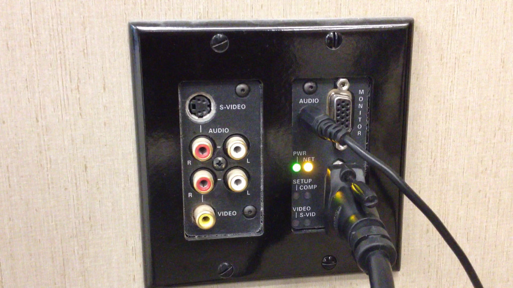
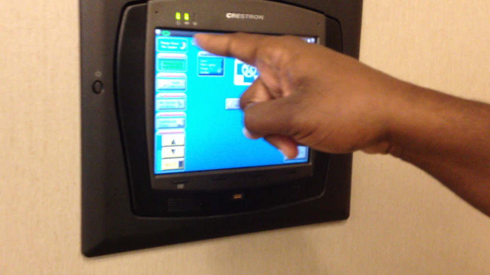
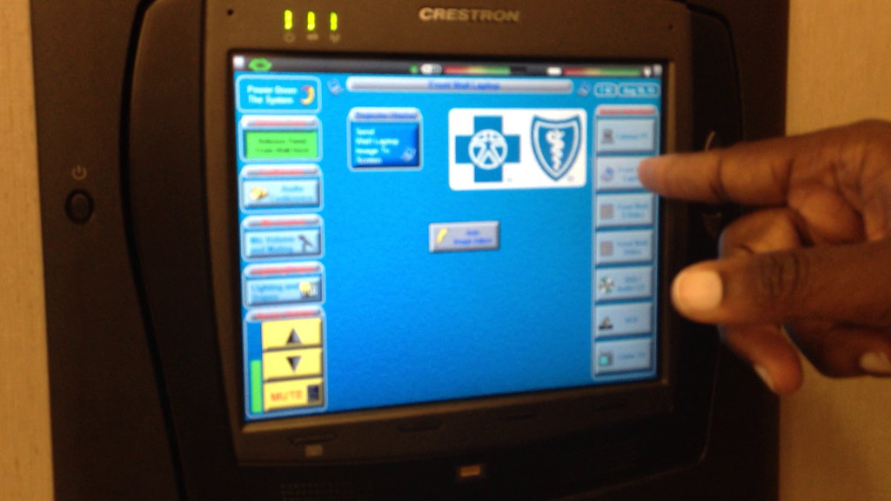
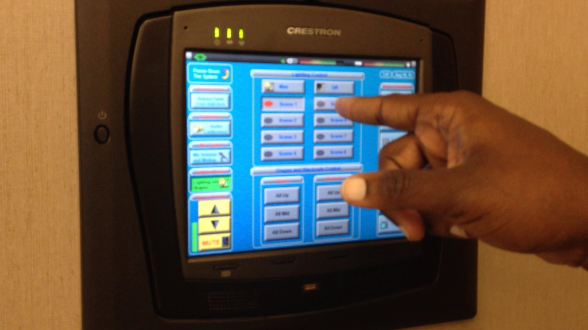
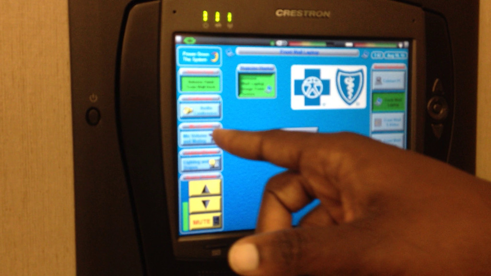
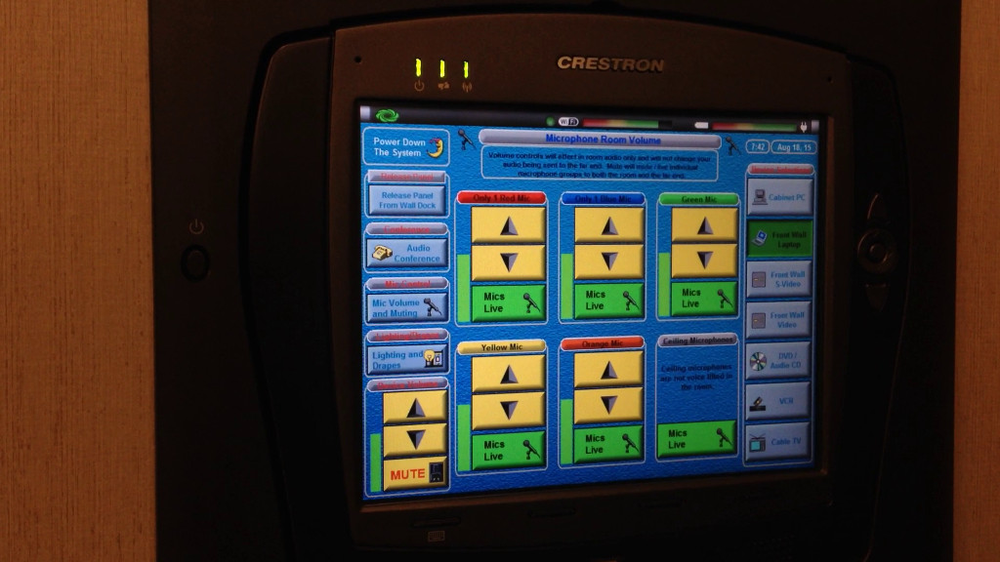

# Pre Meeting

1. Setup meetup.com/omahajava and ojug.org meeting invitations and details
1. Provide BCBS (Marcus and Pernell, use MeetupHosts@nebraskablue.com to contact) the meeting attendee RSVP list for building security (on day of event)
1. Provide food sponsor ([Ben at TekSystems](mailto:bleach@teksystems.com)) the RSVP headcount to supply pizza and drinks (on day of event)

# Meeting Setup

## Wi-Fi

Marcus (or someone from BCBS) should provide this and have it available on the whiteboard

## Projector/Mikes

The wall should be setup like this:

Power button is at the top left:

To turn on laptop, tap "Front Wall Laptop", then "Send Wall Laptop to Screen":

To control lighting and drapes, tap "Lighting and Drapes" on the left. Scene 1 is the lightest, 8 is the darkest:

To control sound/mikes, tap "Mic Volume and Muting". Generally only need to change the Master volume on the left:

## Hook-Ups/Tech Specs

* VGA cable on the podium - (don't forget MacBookPro VGA adapter)
* Projector native resolution is 1366 x 800: Hitachi CP-WX11000 LCD Projector WXGA 1366 x 800 Resolution 6500 Lumens

# During the meeting

It's like [MINASWAN](https://en.wikipedia.org/wiki/MINASWAN) but with java.

1. Be friendly
2. Try to introduce people to each other
3. Try to learn names

## MC Duties

1. Setup a PC with the welcome slides running - https://goo.gl/rK7ySN - edit link for those that have access is (https://docs.google.com/presentation/d/1YLI1aQWYhbGI6KahqI_M2MrMJFzAiGXQfF1AbNwzJ68/edit#slide=id.p)
1. Thank our sponsors
1. Any pre-talk announcements
1. Introduce the talk(s)
1. IntelliJ raffle (using random.org for drawing)
1. SodaAndBeer.java at DJ's Dugout

# Post Meeting
1. Submit raffle winner to JetBrains for IntelliJ license
